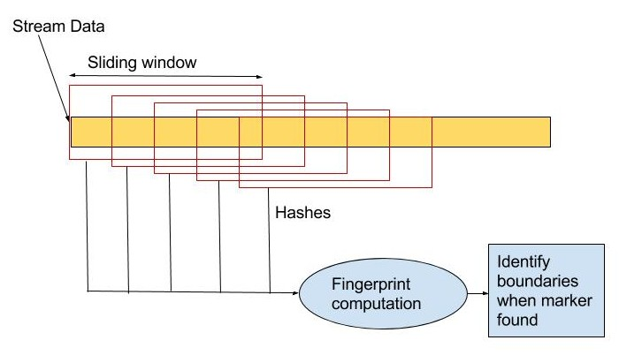
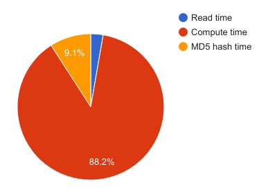

## 1. Summary

We have created optimized parallel implementations of the deduplication module in CloudFS (a hybrid cloud-backed local file system, developed in 18-746: Storage Systems), that makes use of Rabin fingerprinting for chunking on a multi-core CPU platform, and performed a detailed analysis of the system’s performance characteristics. We have also explored using a GPU for accelerating the computation of the Rabin fingerprinting algorithm and implemented a naive version using CUDA.

## 2. Background

## 2.1. CloudFS and deduplication module
In file systems, a common way to avoid redundant computations and storage is to perform deduplication on the data. Cloudfs is one such file system which we developed as a part of 18-746 (Storage Systems) class which performs deduplication across files. The deduplication module detects duplicate content during any write/update operation in the filesystem, using a popular content-based chunking algorithm - The Rabin fingerprinting algorithm. The deduplication module at a high level performs the following 3 operations :  <br>
* It reads the stream of input data in a buffered manner  <br>
* Computes the chunk boundaries using the Rabin fingerprint algorithm  <br>
* Identifies chunks as the data between the chunk boundaries and computes an MD5 hash over each chunk.  <br>

## 2.2. Rabin fingerprinting
It detects boundaries of these chunks in the input data based on the content. A chunk is the data between 2 such boundaries. This may lead to variable sized chunks. <br>

** Figure A: Basic working of Rabin Fingerprinting algorithm** <br><br>
As seen in Figure A, the algorithm computes fingerprints over a sliding window of data. The fingerprint calculation involves polynomial division of a polynomial of degree w-1 for a w bit sequence, with an irreducible polynomial of degree k. This is a very computationally intensive operation. <br>

#### Data structures:
The state of the rabin algorithm is maintained by the rabinpoly library structure : <br>
```javascript
struct rabinpoly {
    u_int64_t poly;                 // Actual polynomial
    unsigned int window_size;       // in bytes
    unsigned int avg_segment_size;  // in KB
    unsigned int min_segment_size;  // in KB
    unsigned int max_segment_size;  // in KB
    u_int64_t fingerprint;      // current rabin fingerprint
    u_int64_t fingerprint_mask; // to check if we are at segment boundary
    u_char *buf;                // circular buffer of size 'window_size'
    unsigned int bufpos;        // current position in ciruclar buffer
    unsigned int cur_seg_size;  // tracks size of the current active segment 
    int shift;
    u_int64_t T[256];       // Lookup table for mod
    u_int64_t U[256];
};
```
#### Operations:
Following key operations are supported by the dedup library: <br>
rabin_init() : initialises the rabinpoly struct and constructs lookup buffers <br>
compute_rabin_segments() : Performs the actual computation of finding the markers/chunk boundaries <br>
rabin_reset(): Use this to use the same rabinpoly struct for a different file <br>
rabin_free(): Called at the end to free all resources allocated by rabin_init() <br>

#### Input and Output to the algorithm:
* Input : <br>
Pointer to the input datastream whose chunk boundaries are to be found <br>
* Output : <br>
List of marker positions indicating chunk boundaries in input data, and number of markers found <br>

## 2.3. Motivation for parallel dedup (Computationally expensive part)

 <br>
**Figure B : Breakdown of the execution times in different sections of the deduplication module. About 88% of dedupe time is spent in computation.** <br><br>
As seen in Figure B, on observing the execution times of various sections in the deduplication module, it was observed that majority of the time was spent in the Rabin Fingerprint function, whereas read and MD5 computation time was much lesser. Thus, The computation time in this case is greater than the I/O or bandwidth latency of the filesystem and it is thus, compute-bound. Hence, content based chunking algorithm will definitely benefit from parallelism as it will directly improve the file system throughput. Our goal was to improve reduce the execution time of the computation by parallelising it.

## 2.4. Dependencies in the program that would affect parallelism
The computation of the fingerprints in the algorithm is optimized by using the fingerprint of the previous window to calculate the fingerprint of the current window. Hence, it could be challenging to make it data parallel. Since different threads would work on different sections of data, it could be challenging to compute fingerprint especially for windows that cover data from 2 threads.

