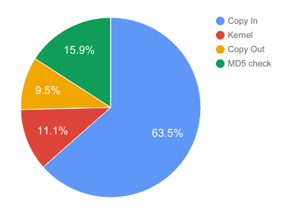

## 1. Summary

We have created optimized parallel implementations of the deduplication module in CloudFS (a hybrid cloud-backed local file system, developed in 18-746: Storage Systems), that makes use of Rabin fingerprinting for chunking on a multi-core CPU platform, and performed a detailed analysis of the system’s performance characteristics. We have also explored using a GPU for accelerating the computation of the Rabin fingerprinting algorithm and implemented a naive version using CUDA.

## 2. Background

## 2.1. CloudFS and deduplication module
In file systems, a common way to avoid redundant computations and storage is to perform deduplication on the data. Cloudfs is one such file system which we developed as a part of 18-746 (Storage Systems) class which performs deduplication across files. The deduplication module detects duplicate content during any write/update operation in the filesystem, using a popular content-based chunking algorithm - The Rabin fingerprinting algorithm. The deduplication module at a high level performs the following 3 operations :  <br>
* It reads the stream of input data in a buffered manner  <br>
* Computes the chunk boundaries using the Rabin fingerprint algorithm  <br>
* Identifies chunks as the data between the chunk boundaries and computes an MD5 hash over each chunk.  <br>

## 2.2. Rabin fingerprinting
It detects boundaries of these chunks in the input data based on the content. A chunk is the data between 2 such boundaries. This may lead to variable sized chunks. <br>
 <br>
**Figure A: Basic working of Rabin Fingerprinting algorithm** <br><br>
As seen in Figure A, the algorithm computes fingerprints over a sliding window of data. The fingerprint calculation involves polynomial division of a polynomial of degree w-1 for a w bit sequence, with an irreducible polynomial of degree k. This is a very computationally intensive operation. <br>

#### Data structures:
The state of the rabin algorithm is maintained by the rabinpoly library structure : <br>
```javascript
struct rabinpoly {
    u_int64_t poly;                 // Actual polynomial
    unsigned int window_size;       // in bytes
    unsigned int avg_segment_size;  // in KB
    unsigned int min_segment_size;  // in KB
    unsigned int max_segment_size;  // in KB
    u_int64_t fingerprint;      // current rabin fingerprint
    u_int64_t fingerprint_mask; // to check if we are at segment boundary
    u_char *buf;                // circular buffer of size 'window_size'
    unsigned int bufpos;        // current position in ciruclar buffer
    unsigned int cur_seg_size;  // tracks size of the current active segment 
    int shift;
    u_int64_t T[256];       // Lookup table for mod
    u_int64_t U[256];
};
```
#### Operations:
Following key operations are supported by the dedup library: <br>
rabin_init() : initialises the rabinpoly struct and constructs lookup buffers <br>
compute_rabin_segments() : Performs the actual computation of finding the markers/chunk boundaries <br>
rabin_reset(): Use this to use the same rabinpoly struct for a different file <br>
rabin_free(): Called at the end to free all resources allocated by rabin_init() <br>

#### Input and Output to the algorithm:
* Input : <br>
Pointer to the input datastream whose chunk boundaries are to be found <br>
* Output : <br>
List of marker positions indicating chunk boundaries in input data, and number of markers found <br>

## 2.3. Motivation for parallel dedup (Computationally expensive part)

 <br>
**Figure B : Breakdown of the execution times in different sections of the deduplication module. About 88% of dedupe time is spent in computation.** <br><br>
As seen in Figure B, on observing the execution times of various sections in the deduplication module, it was observed that majority of the time was spent in the Rabin Fingerprint function, whereas read and MD5 computation time was much lesser. Thus, The computation time in this case is greater than the I/O or bandwidth latency of the filesystem and it is thus, compute-bound. Hence, content based chunking algorithm will definitely benefit from parallelism as it will directly improve the file system throughput. Our goal was to improve reduce the execution time of the computation by parallelising it.

## 2.4. Dependencies in the program that would affect parallelism
The computation of the fingerprints in the algorithm is optimized by using the fingerprint of the previous window to calculate the fingerprint of the current window. Hence, it could be challenging to make it data parallel. Since different threads would work on different sections of data, it could be challenging to compute fingerprint especially for windows that cover data from 2 threads.

## 3. Approach

## 3.1. Parallel Rabin fingerprinting algorithm
 <br>
**Figure C : Idea of parallelism in Rabin fingerprinting algorithm** <br>

We employ parallel threads to work on different chunks of the input data stream read by a single iteration of the dedup module in CloudFS. Each thread performs Rabin fingerprinting on its chunk using local rabinpoly_t state. As mentioned above, there is dependency across thread boundaries for an optimized computation in the sliding window fingerprinting. However, to parallelize the algorithm, we can give up on this optimization across thread boundaries by having each thread compute the rabin fingerprint for up to (WINDOW_SIZE-1) bytes in the subsequent thread’s chunk space. The small amount of redundant WINDOW_SIZE computation is not an overhead due to potential speedup possible in the large data stream processing. The “Overlap” in the figure shows one such region where the synchronization requirement can be overcome by this extra computation. However, since the last thread does not have future input data available to it, it cannot do the same, and hence must synchronize with the first thread that will process the subsequent data in the next iteration from the dedup module. This can be done using #omp pragma barrier in the naive approach, but this synchronization can be optimized further.

## 3.2. Environment
**Technologies** <br>
* CPU-parallelism: OpenMP <br>
* GPU-parallelism: CUDA <br>
* Test framework: Python <br>
* CloudFS: C, C++, Python, libs3, tornado server <br>

**Target hardware** <br>
* 8-core (hyperthreaded) 3.20 GHz Intel Xeon i7 processors <br>
* NVIDIA GeForce GTX 1080 GPUs <br>

**Machines used** <br>
GHC41.GHC.ANDREW.CMU.EDU and GHC45.GHC.ANDREW.CMU.EDU <br>

## 3.3. Mapping the problem to target parallel machines
* **CPU parallelism:** <br>
	We used 16 OpenMP threads to populate the 16 execution contexts of the 8-core 2-way multithreaded CPU on GHC. Each thread worked on a 1 KB section of the input buffer (in total, a 16 KB buffer is read from the file iteratively by the dedup module and each thread is supplied a 1 KB chunk of the data). <br>
* **GPU parallelism:** <br>
	We used 2048\*20 CUDA threads to populate the 2048 execution contexts of the 20-core GTX 1080 GPU on GHC. Each thread worked on a 1 KB section of the input buffer (in total, a 2048\*20 KB buffer is read from the file iteratively and each thread is supplied a 1 KB chunk of the data). <br>

## 3.4. Change in original serial algorithm to benefit from parallelism
Original serial algorithm (rabin_segment_next() API of the rabin fingerprint library) invoked by the dedup module of CloudFS processes the input buffer and returns as soon as it detects a marker. It is an iterative function that maintains the computation state within the rabinpoly_t structure passed to it across invocations. In order to implement a parallel version of rabin fingerprinting to detect segment boundaries, we need to implement a one-time call that processes a huge batch of data and determines the marker positions in the data stream, by employing multiple threads to work on different sections of the data stream. Hence, we implemented a better parallelizable version of the serial algorithm (compute_rabin_segments_serial() and its later counterparts- compute_rabin_segments_cpu() for CPU-parallel version and compute_rabin_segments_gpu() for GPU-parallel version). These versions simply process the entire buffer and returns all marker positions detected in the entire sequence. This enables employing multi-core as well as data-parallelism in the function versions.

## 3.5 Iterations of optimization
TBD

## 3.6 Starter codebase
CloudFS project that we developed in our 18746 (Storage Systems) class, a single threaded hybrid FUSE-based file system. 
(Project URL available on demand).

## 4. Results

## 4.1. Measuring performance
We have measured the following execution times for various code sections for the serial, CPU parallel and GPU parallel versions of the Rabin hash algorithm : <br>
* Total time for deduplication to happen <br>
* Time to read from data stream in the algorithm <br>
* Time to do the actual computations of Rabin Fingerprinting algorithm <br>
* Time to compute MD5 hash algorithm <br>

We have also measured the speedup for the Rabin fingerprint algorithm compute time as well as the speedup of the entire deduplication module with respect to the serial implementation. <br>

## 4.2. Experimental setup: (input sizes, generation of requests)
We performed experiments by invoking the deduplication module in 2 ways : <br>
* Directly invoking deduplication on a file created through a test <br>
* Invoking the deduplication module by performing writes to CloudFS. Upon write requests, CloudFS invokes the deduplication module. <br>

We performed various tests by varying the write sizes from 4KB to 512KB. We also experimented with different file sizes (which can be controlled based on the number of writes)  ranging from 1 MB to 1GB. <br>

The writes requests consisted of uniform as well as random data which were invoked by various tests. The tests invoke the serial, CPU parallel and GPU parallel versions of the deduplication module and the above measurements are taken. <br>

## 4.3. Graphs of speedup or execute time
 <br>
**Figure 3.1: Compute time vs Number of threads** <br>
Figure 3.1 shows the execution times of only the compute portion of the Rabin fingerprint algorithm by varying the number of threads. We observe a linear drop in the execution time for the CPU Parallel version, when changing the number of threads from 1 to 16.  <br>
 <br>
**Figure 3.2: Compute time vs Write Size** <br>
Since 16 threads gave the best performance, we fixed the number of threads = 16 for further observations. Figure 3.2 shows the execution times of only the compute portion of the Rabin fingerprint algorithm by varying the size of individual writes from 4KB to 64 KB. It is observed that as the write size increases, the serial version starts performing poorly whereas the parallel version is very fast. Thus, the speedup goes on increasing as the write size increases. <br>
 <br>
**Figure 3.3: Rabin compute time and Deduplication module compute time: serial vs parallel (Write size = 256 KB)** <br>
TBD<br>
 <br>
**Figure 3.4: Rabin compute time and Deduplication module compute time: serial vs parallel (Write size = 512 KB)** <br>
The graphs in Figure 3.3 and 3.4 show the execution times of the Rabin computation alone as well the entire deduplication module. Measurements are taken for write sizes 256KB and 512 KB for the serial and cpu parallel versions. It is observed that for write sizes 256 KB, the cpu parallel version gives a speedup of 7x for the Rabin computation and a total speedup of 3.5x for the entire deduplication module, over the serial version. Similarly, for write sizes 512 KB, the cpu parallel version gives a speedup of 8x for the Rabin computation and a total speedup of 3.6x for the entire deduplication module over the serial version. The entire deduplication module is not able to achieve a perfect speedup because the MD5 computation is the serial portion which is not parallelized. <br>

## 4.4 Analysis: limitations in speedup and breakdown of execution time
<br>
 <br>
**Figure 3.5:** <br>

## 4.5 Choice of machine: CPU/GPU
TBD <br>

## 5. References

1. Samer Al-Kiswany, Abdullah Gharaibeh, Matei Ripeanu, GPUs as Storage System Accelerators, IEEE TRANSACTIONS ON PARALLEL AND DISTRIBUTED SYSTEMS, VOL. 24, NO. 8, AUGUST 2013.
2. Udi Manber, Finding Similar Files in a Large File System, USENIX Winter 1994 Technical Conference Proceedings, Jan. 17-21, 1994, San Francisco, CA.
3. Pramod Bhatotia, Rodrigo Rodrigues, Akshat Verma, Shredder: GPU-Accelerated Incremental Storage and Computation
4. Rabin fingerprinting library: https://github.com/joeltucci/rabin-fingerprint-c
5. Rabin fingerprinting original documentation by Michael O Rabin: http://www.xmailserver.org/rabin.pdf
6. Rabin fingerprinting original paper (Finding Similar Files in a Large File System):
7. http://citeseerx.ist.psu.edu/viewdoc/download?doi=10.1.1.12.3222&rep=rep1&type=pdf
8. LBFS usecase for Rabin fingerprinting: https://github.com/fd0/lbfs/tree/master/liblbfs
9. Rabin GPU for network packet dedup: https://github.com/aimlab/rabinGPU
10. OpenMP: https://computing.llnl.gov/tutorials/openMP/
11. CUDA: https://docs.nvidia.com/cuda/cuda-c-programming-guide/#compute-capabilities

## 6. List of work done by each student

#### Equal work was performed by both project members.
